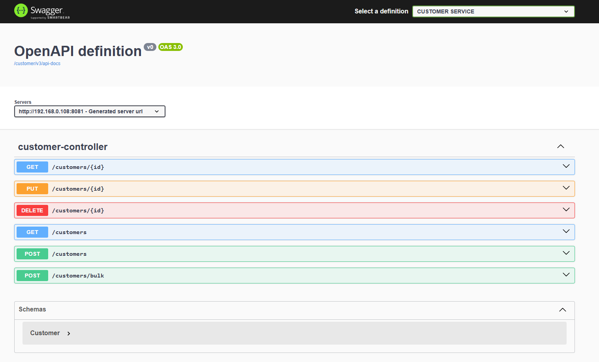
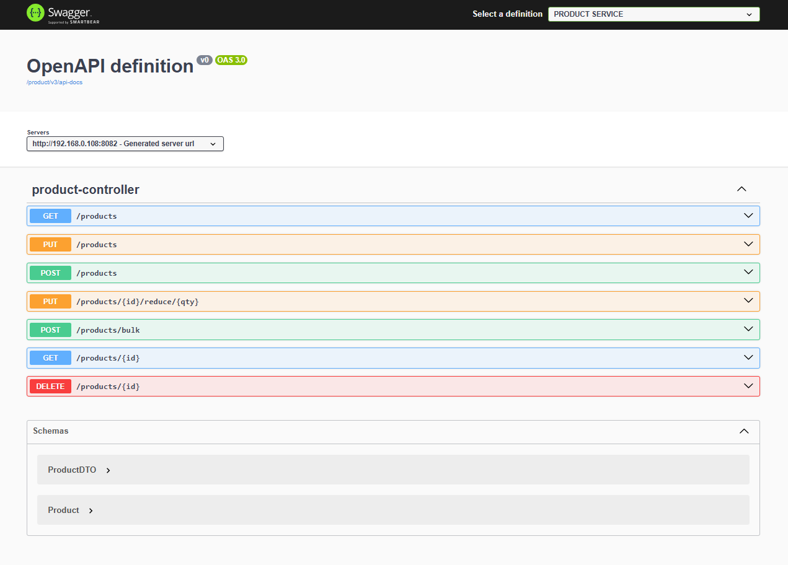
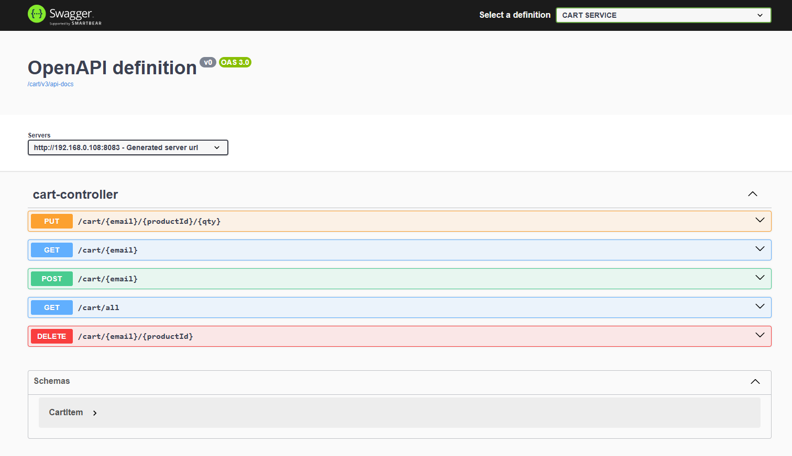
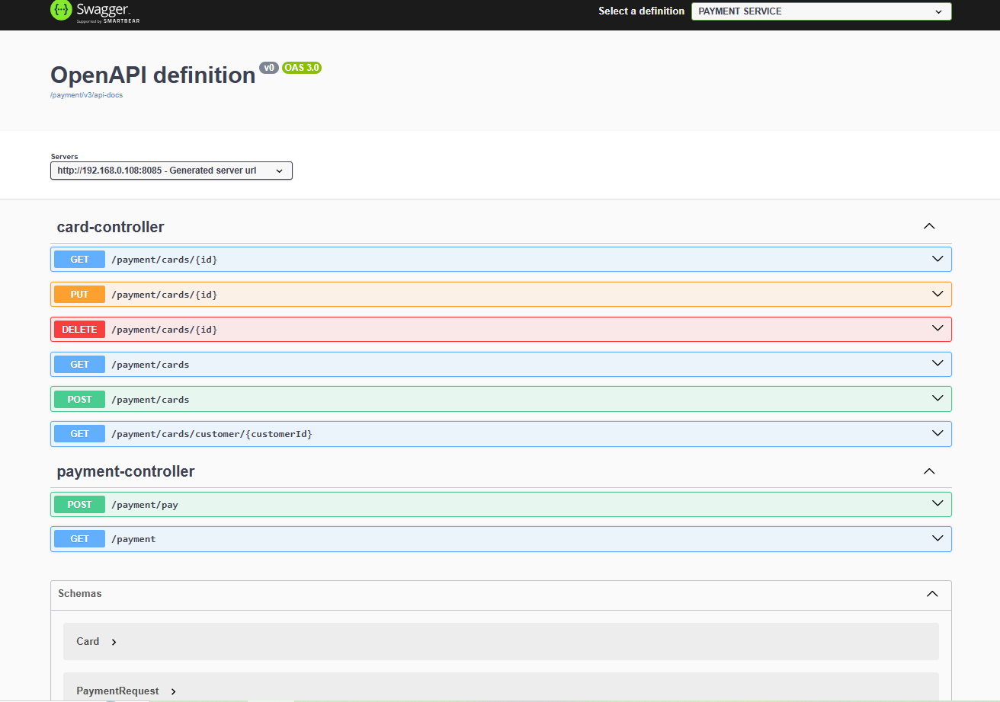
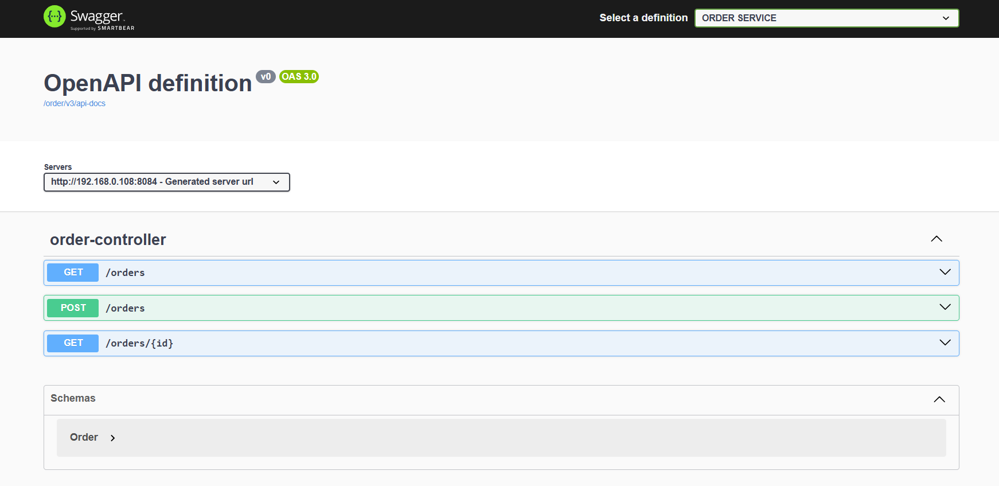

🛒 Ekart E-Commerce Microservices Application

📌 Project Overview
Ekart is a backend e-commerce application built using Spring Boot microservices architecture. The system is divided into multiple independent services like Customer, Product, Cart, Order, and Payment, each handling a specific business function.
The application demonstrates service-to-service communication, centralized routing, and scalable system design.
________________________________________
🏗️ Architecture
•	Microservices-based architecture 
•	Each service runs independently 
•	Communication via REST APIs 
•	Service discovery using Eureka 
•	Centralized routing using API Gateway 
(Optional: You can add a diagram image later in GitHub)
________________________________________
⚙️ Services Overview
Service	Description
Customer Service	Manages customer data (registration, login, profile)
Product Service	        Handles product catalog and inventory
Cart Service	        Manages cart items for customers
Order Service	        Processes orders and maintains order status
Payment Service	        Handles payment processing
Eureka Server	        Service registry for discovery
API Gateway	        Routes all client requests to appropriate services
________________________________________
🔧 Tech Stack
•	Java 
•	Spring Boot 
•	Spring Cloud (Eureka, Gateway) 
•	Spring Data JPA (Hibernate) 
•	MySQL 
•	REST APIs 
•	OpenFeign / RestTemplate 
•	Swagger UI 
•	Postman 
________________________________________
🔄 Key Features
•	Microservices-based modular design 
•	Service discovery using Eureka Server 
•	API Gateway for centralized routing 
•	Inter-service communication using REST 
•	Order–Payment workflow integration 
•	CRUD operations across all services 
•	Error handling for service failures 
•	Scalable and loosely coupled architecture 
________________________________________
🚀 How to Run the Project

1. Clone the repository
git clone https://github.com/your-username/ekart-microservices.git

cd ekart-microservices

2. Start services in order

Run the services in this sequence:
1.	Eureka Server 
2.	API Gateway 
3.	Customer Service 
4.	Product Service 
5.	Cart Service 
6.	Order Service 
7.	Payment Service 
________________________________________
3. Configure MySQL
Create databases for each service (example):
create database customermsdb;
create database productdb;
create database customercartdb;
create database orderdb;
create database paymentdb;
Update application.properties in each service with your DB credentials.
________________________________________
4. Access Services
•	Eureka Dashboard:
http://localhost:8761 
•	API Gateway:
http://localhost:8080 
•	Swagger (example):
http://localhost:4000/swagger-ui.html 
________________________________________
🔌 Service Ports
Service	Port
Eureka Server	       8761
API Gateway	       8080
Customer Service       8081
Product Service	       8082
Cart Service	       8083
Order Service	       8084
Payment Service	       8085
________________________________________
🧪 Testing
•	Tested APIs using Postman 
•	Used Swagger UI for API documentation and validation 
•	Verified inter-service communication 
________________________________________
⚠️ Common Issues
•	404 from another service → Check if service is running and registered in Eureka 
•	500 error → Check logs for exception (DB, null values, or service call failure) 
•	Service not found → Verify service name in URL (e.g., PRODUCTMS) 
________________________________________
📈 Future Improvements
•	Add authentication (Spring Security + JWT) 
•	Use Kafka for asynchronous communication 
•	Implement Circuit Breaker (Resilience4j) 
•	Add Docker support 
                           

# ===============================
# Java / Spring Boot
# ===============================
target/
*.class
*.jar
*.war
*.ear

# Logs
*.log
logs/
spring.log

# Maven
.mvn/wrapper/maven-wrapper.jar

# ===============================
# IDE Files
# ===============================

# Eclipse
.project
.classpath
.settings/

# Screenshots
--------------------------------------------

### Eureka Server

### Customer Service

### Product Service

### Cart Service

### Payment Service

### Order Service

